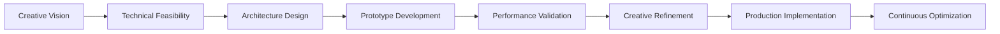

# 🎯 Creative Tech Lead Methodology

> **Kevin Parra Lopez - Technical Leadership Framework**  
> _Systematic approach to creative technology project delivery_

## 🧠 Leadership Philosophy

### **Human-Centered Technology**

As a Creative Tech Lead, I believe technology should amplify human creativity and connection. Every technical decision is evaluated through the lens of user experience and team empowerment.

### **Performance as Creative Foundation**

Smooth, responsive experiences enable more ambitious creative visions. Technical excellence isn't separate from creativity—it's what makes bold creative ideas possible.

### **Collaborative Excellence**

The best creative technology emerges from seamless collaboration between designers, developers, and stakeholders. Architecture and processes should facilitate, not hinder, this collaboration.

## 🔬 Technical Decision Framework

### **Evaluation Matrix**

```typescript
interface TechnicalDecision {
  impact: {
    userExperience: 1 | 2 | 3 | 4 | 5; // Higher is better
    teamProductivity: 1 | 2 | 3 | 4 | 5; // Developer experience
    performance: 1 | 2 | 3 | 4 | 5; // Runtime efficiency
    maintainability: 1 | 2 | 3 | 4 | 5; // Long-term sustainability
    scalability: 1 | 2 | 3 | 4 | 5; // Growth accommodation
  };

  cost: {
    implementationTime: number; // Hours to implement
    learningCurve: 1 | 2 | 3 | 4 | 5; // Team adoption difficulty
    maintenance: 1 | 2 | 3 | 4 | 5; // Ongoing support needs
    risk: 1 | 2 | 3 | 4 | 5; // Technical/business risk
  };

  timeline: {
    immediate: boolean; // Can start immediately
    shortTerm: boolean; // 1-4 weeks
    mediumTerm: boolean; // 1-3 months
    longTerm: boolean; // 3+ months
  };
}
```

### **Decision Principles**

1. **User Experience Primacy** - If it doesn't improve UX, question its value
2. **Team Velocity** - Choose tools that make the team more productive
3. **Performance Budget** - Every feature must justify its performance cost
4. **Maintainability** - Code quality enables long-term creative iteration
5. **Risk Balance** - Innovation tempered with delivery reliability

## 🎨 Creative Process Integration

### **Design-Development Bridge**



### **Collaborative Workflows**

#### **Daily Creative Sync**

- **Morning Stand-up** (15 min)
  - Creative progress and blockers
  - Technical implementation status
  - Cross-functional dependencies
  - Performance metric review

#### **Weekly Creative Review**

- **Creative Validation** (30 min)
  - User experience testing
  - Visual and interaction refinement
  - Performance benchmarking
  - Stakeholder feedback integration

#### **Sprint Planning with Creative Focus**

- **Vision Alignment** (60 min)
  - Creative goals prioritization
  - Technical implementation planning
  - Resource allocation optimization
  - Risk assessment and mitigation

## 🚀 Performance-Driven Development

### **Performance Budget Management**

```typescript
interface PerformanceBudget {
  frameRate: {
    target: 60; // fps minimum
    budget: 16.67; // ms per frame
    monitoring: "real-time";
  };

  memory: {
    baseline: 50; // MB initial load
    maximum: 200; // MB under load
    monitoring: "continuous";
  };

  network: {
    initialLoad: 3000; // ms time to interactive
    assetLoading: 1000; // ms per additional asset
    monitoring: "synthetic";
  };

  gpu: {
    utilization: 80; // % maximum sustainable
    drawCalls: 100; // per frame maximum
    monitoring: "profiled";
  };
}
```

### **Optimization Methodology**

1. **Measure First** - Establish baseline metrics before optimization
2. **Profile Regularly** - Continuous monitoring during development
3. **Optimize Iteratively** - Small improvements, validated immediately
4. **User-Centric Metrics** - Focus on perceived performance
5. **Cross-Device Validation** - Test on target hardware range

## 🧪 Innovation Management

### **Experimentation Framework**

```typescript
interface ExperimentProtocol {
  hypothesis: string; // What we're testing
  success_criteria: Metric[]; // How we measure success
  risk_assessment: RiskLevel; // Potential impact of failure
  timeline: Duration; // Time box for experiment
  fallback_plan: string; // What to do if it fails
  stakeholder_buy_in: boolean; // Team and business alignment
}
```

### **Technology Adoption Strategy**

- **Bleeding Edge** (5%) - Experimental, high-risk technologies
- **Leading Edge** (20%) - Proven but new technologies
- **Mainstream** (60%) - Well-established, reliable technologies
- **Legacy** (15%) - Mature technologies for critical systems

### **Innovation Risk Management**

1. **Proof of Concept** - Validate core technical assumptions
2. **Prototype** - Test integration and performance characteristics
3. **Pilot** - Limited production deployment for validation
4. **Gradual Rollout** - Incremental adoption with monitoring
5. **Full Integration** - Complete implementation with optimization

## 👥 Team Leadership Approach

### **Individual Growth Framework**

```typescript
interface TeamMemberGrowth {
  current_skills: SkillAssessment;
  growth_goals: LearningObjective[];
  mentorship_needs: MentorshipArea[];
  project_contributions: ContributionMetric[];
  career_aspirations: CareerPath;
  feedback_frequency: "weekly" | "biweekly" | "monthly";
}
```

### **Knowledge Sharing Culture**

- **Code Reviews** - Learning opportunities, not just error catching
- **Technical Talks** - Team members present interesting solutions
- **Documentation** - Living documents that evolve with the project
- **Pair Programming** - Knowledge transfer and problem solving
- **External Learning** - Conference attendance and online courses

### **Creative Collaboration Facilitation**

- **Design-Dev Pairing** - Regular collaboration sessions
- **Rapid Prototyping** - Quick validation of creative concepts
- **User Testing** - Regular feedback integration
- **Creative Constraints** - Technical limitations as creative opportunities
- **Cross-functional Understanding** - Everyone understands the full stack

## 📈 Project Success Metrics

### **Technical Excellence Indicators**

- **Code Quality** - Test coverage, static analysis scores
- **Performance** - Real-time metrics vs. targets
- **Maintainability** - Time to implement new features
- **Developer Experience** - Build times, deployment frequency
- **Bug Rate** - Issues per release, resolution time

### **Creative Achievement Measures**

- **User Engagement** - Time spent, interaction depth
- **Aesthetic Quality** - Design consistency, visual impact
- **Innovation Index** - Novel approaches implemented
- **Accessibility** - Inclusive design implementation
- **Cross-platform Consistency** - Experience quality across devices

### **Business Impact Assessment**

- **Delivery Predictability** - On-time, on-budget completion
- **Stakeholder Satisfaction** - Client and user feedback scores
- **Team Productivity** - Features delivered per sprint
- **Knowledge Transfer** - Documentation quality and completeness
- **Talent Retention** - Team member satisfaction and growth

## 🔄 Continuous Improvement Process

### **Retrospective Framework**

- **What Worked Well** - Successes to replicate
- **What Could Improve** - Areas for optimization
- **Action Items** - Specific improvements with owners
- **Experiments** - New approaches to try
- **Metrics Review** - Data-driven insights

### **Learning Integration**

- **Industry Trends** - Staying current with creative technology
- **Community Engagement** - Contributing to open source projects
- **Conference Participation** - Learning and sharing knowledge
- **Mentor Network** - Learning from senior practitioners
- **Cross-Industry Insights** - Applying learnings from other fields

---

**This methodology represents a systematic approach to Creative Technology Leadership, balancing technical excellence, creative innovation, and team development in pursuit of exceptional digital experiences.**

_"The best creative technology emerges from the intersection of disciplined engineering and unbounded imagination."_
